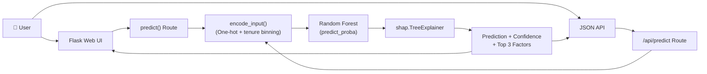

<p align="center">
  
</p>

<p align="center">
  <a href="https://customer-churn-predictor-jha2.onrender.com/" target="_blank">
    
  </a>
</p>

<p align="center">
  <a href="#features">Features</a> ·
  <a href="#architecture">Architecture</a> ·
  <a href="#quick-start">Quick Start</a> ·
  <a href="#usage">Usage</a> ·
  <a href="#api">API</a> ·
  <a href="#project-structure">Structure</a> ·
  <a href="#comparison">Comparison</a>
</p>

<p align="center">
  
  
  
  
  
  
</p>

---

Predict whether a telecom customer will churn, with per-customer explanations powered by SHAP. Enter customer details in the form or use the JSON API — get a prediction, confidence score, and the top 3 reasons driving that prediction.

## Features

- **Random Forest Classifier** — Trained on 7,047 telecom customer records
- **SHAP Explanations** — Per-customer feature importance, not global averages
- **Form + JSON API** — Web UI for humans, `/api/predict` for automation
- **Colored Result Banner** — Red for churn, green for stay — impossible to miss
- **Input Validation** — Type-checked numeric fields with min/max constraints
- **Loading State** — Button disables on click, prevents double submissions
- **Human-Readable Labels** — Raw ML column names mapped to plain English
- **Adjustable Threshold** — 0.35 default (tuned for business sensitivity)

## Architecture



| Component | Stack |
|---|---|
| **Frontend** | HTML + CSS (Jinja2 templates) |
| **Backend** | Flask (Python) |
| **Model** | RandomForestClassifier (scikit-learn 1.6.1) |
| **Explanations** | SHAP TreeExplainer |
| **Deployment** | Render (gunicorn) |

## Quick Start

```bash
git clone https://github.com/kairav7220/customer-churn-predictor.git
cd customer-churn-predictor
pip install -r requirements.txt
```

```bash
python app.py
```

Open `http://127.0.0.1:5000` in your browser.

## Usage

### Web UI

1. Fill in the 19 customer fields (selects for categoricals, numbers for charges/tenure)
2. Click **Predict Churn**
3. Read the result banner — churn or stay with confidence percentage
4. Review the **top 3 factors** driving this specific prediction

### API

```bash
curl -X POST https://customer-churn-predictor-jha2.onrender.com/api/predict \
  -H "Content-Type: application/json" \
  -d '{
    "SeniorCitizen": "0",
    "MonthlyCharges": "70.0",
    "TotalCharges": "1500.0",
    "gender": "Female",
    "Partner": "Yes",
    "Dependents": "No",
    "PhoneService": "Yes",
    "MultipleLines": "No",
    "InternetService": "Fiber optic",
    "OnlineSecurity": "No",
    "OnlineBackup": "No",
    "DeviceProtection": "No",
    "TechSupport": "No",
    "StreamingTV": "Yes",
    "StreamingMovies": "Yes",
    "Contract": "Month-to-month",
    "PaperlessBilling": "Yes",
    "PaymentMethod": "Electronic check",
    "tenure": "12"
  }'
```

Response:

```json
{
  "prediction": "churn",
  "confidence": 0.92,
  "top_factors": [
    {"feature": "Month-to-month Contract", "shap": 0.053},
    {"feature": "Tenure 1–12 months", "shap": 0.046},
    {"feature": "Fiber Optic Internet", "shap": 0.038}
  ]
}
```

## Comparison

| Feature | Customer Churn Predictor | Basic Churn App | Enterprise Tool |
|---|---|---|---|
| Per-Customer Explanations | ✅ SHAP TreeExplainer | ❌ Global only | ✅ |
| API | ✅ JSON + Form | ❌ Form only | ✅ |
| Input Validation | ✅ Frontend + Backend | ❌ | ✅ |
| Model Loaded Once | ✅ Module-level | ❌ Per-request | ✅ |
| Adjustable Threshold | ✅ 0.35 tuned | ❌ Default 0.5 | ✅ |
| Human-Readable Labels | ✅ 50-column display map | ❌ Raw names | ✅ |
| Deploy Ready | ✅ Render + gunicorn | ❌ Dev server | ✅ |

## Project Structure

```
customer-churn-predictor/
├── app.py                  # Flask app (routes + encoding + SHAP)
├── model.sav               # Trained RandomForest model
├── tel_churn.csv           # Training data (7,047 records)
├── templates/
│   └── home.html           # Web UI form + result banner
├── requirements.txt        # Python dependencies
├── .gitignore
└── LICENSE
```

## License

MIT © [kairav7220](https://github.com/kairav7220)

---

<p align="center">
  Built with <a href="https://flask.palletsprojects.com">Flask</a> ·
  <a href="https://scikit-learn.org">scikit-learn</a> ·
  <a href="https://shap.readthedocs.io">SHAP</a> ·
  <a href="https://render.com">Render</a>
</p>
